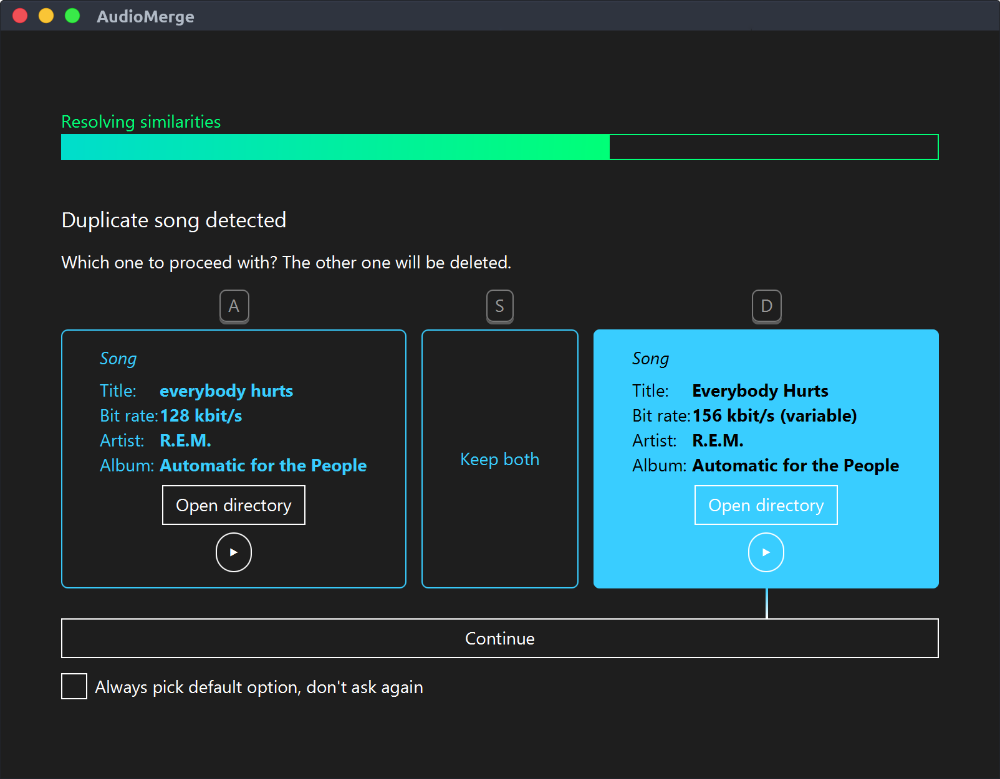

## The problem

Personal digital music collections are often a mess.
They build up over years of acquiring songs from different sources and moving them around among devices.
Individual copies of the original collection start to diverge due to adding more songs, platform-targeting conversion or music players altering metadata. 
As a result, songs are present multiple times in different formats, varying quality and with inconsistent metadata like artist or album.

Sorting these issues out manually is not quite feasible if the collection contains thousands of songs and is divided into multiple versions.
However, since many duplicates are equally or similarly named, this process can be mostly automated.

## The solution

AudioMerge parses music collections looking out for similarities in artist, album and songs.
If two items match exactly, they're merged immediately.
In case of a similarity but not an exact match, like a typo in an artist name, it prompts the user whether those two items should be merged, and if so, which one to proceed with.

## Download

In order to run AudioMerge, you need to have [Java (version 8 or newer)](https://java.com/de/download/) installed.

The latest version of AudioMerge can be downloaded from [**the release section on GitHub**](https://github.com/CedricReichenbach/audiomerge/releases/latest).

## Known issues

*Found another issue? Please report it [here](https://github.com/CedricReichenbach/audiomerge/issues/new)*

#### Limited WAV support

The used library for metadata manipulation [Jaudiotagger](http://www.jthink.net/jaudiotagger/index.jsp) only provides partial support for Wav and Real audio formats.
As a consequence, song artists and album titles may not be correctly loaded or overridden for such files.
