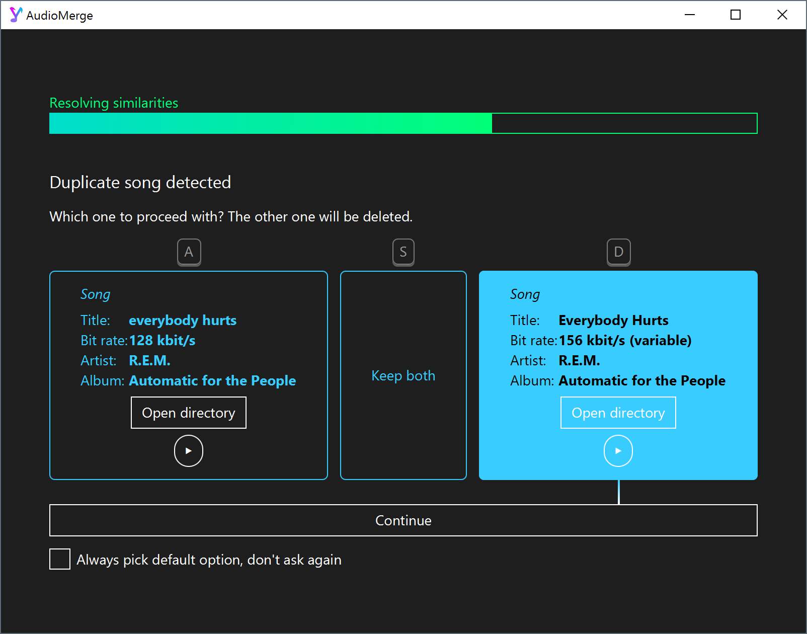

# audiomerge
Merge multiple scattered music collections into one, taking only the best version of duplicates

## Known issues

### Limited WAV support

The used library for metadata manipulation [Jaudiotagger](http://www.jthink.net/jaudiotagger/index.jsp) only provides partial support for Wav and Real audio formats.
As a consequence, song artists and album titles may not be correctly loaded or overridden for such files.
